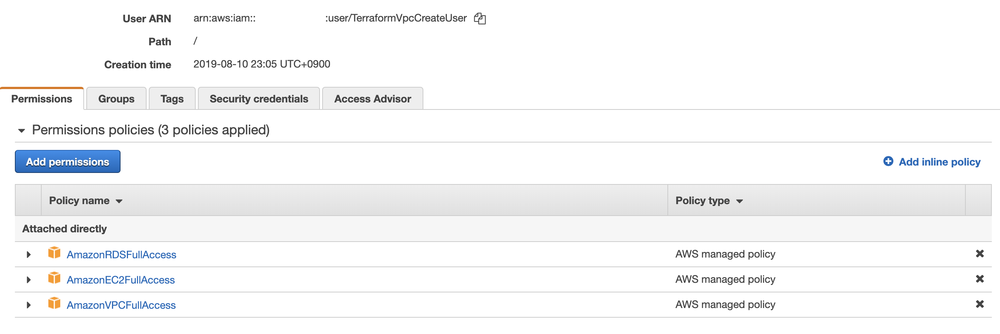

# VPC 리소스 생성 코드

AWS Provider 기준 코드

## Installation

사전에 VPC, EC2, RDS 관련 권한이 필요합니다.

필요한 권한

- `VPCFullAccess`
- `RDSFullACcess`
- `AmazonEC2FullAccess`

Instance Profile을 활용하거나
Access Key를 발급해 사용이 가능합니다.

직접 키 값을 넣어 사용하는 경우

```
provider "aws" {
  region     = "us-west-2"
  access_key = "anaccesskey"
  secret_key = "asecretkey"
}
```

환경 변수를 이용한 설정

```
export AWS_ACCESS_KEY_ID="anaccesskey"
export AWS_SECRET_ACCESS_KEY="asecretkey"
export AWS_DEFAULT_REGION="ap-northeast-2"
```

## Usage

### VPC 리소스 생성하기

User를 생성하고 엑세스 키 발급 후 Programming access 방식을 이용해 VPC를 생성하는 경우 아래와 같은 User를 생성한다.



해당 User를 이용해 엑세스 키를 발급하고 아래 내용을 환경 변수에 추가한다.

```bash
export AWS_ACCESS_KEY_ID="anaccesskey"
export AWS_SECRET_ACCESS_KEY="asecretkey"
export AWS_DEFAULT_REGION="ap-northeast-2"
``` 

아래 내용을 참고해 vpc.tfvars 파일을 구성한다.

### Inputs

| Name                | Description                                 |  Type  |   Default   | Required |
| ------------------- | ------------------------------------------- | :----: | :---------: | :------: |
| name                | 모듈에서 정의하는 모든 리소스 이름의 prefix | string |     n/a     |   yes    |
| cidr                | VPC에 할당한 CIDR block                     | string |     n/a     |   yes    |
| public_subnets      | Public Subnet IP 리스트                     |  list  |     n/a     |   yes    |
| private_subnets     | Private Subnet IP 리스트                    |  list  |     n/a     |   yes    |
| database_subnets    | Database Subnet IP 리스트                   |  list  |     n/a     |   yes    |
| availability_zones  | 사용할 availability zones 리스트            |  list  |     n/a     |   yes    |
| bastion_name        | 모듈에서 정의하는 모든 리소스 이름의 prefix | string |     n/a     |   yes    |
| instance_type       | bastion EC2 instance type                   | string | `"t2.nano"` |    no    |
| ec2_ssh_key         | bastion이 사용할 keypair name               | string |     n/a     |   yes    |
| nat_gateway_enable  | nat gateway 설정 여부, false인 경우 instance 사용     | string |     n/a     |   yes    |
| ingress_cidr_blocks | bastion SSH 접속을 허용할 CIDR block 리스트 |  list  |     n/a     |   yes    |
| tags                | 모든 리소스에 추가되는 tag 맵               |  map   |     n/a     |   yes    |


그리고 아래 명령어를 순차적으로 실행 해 Vpc, Subnet, Bastion(NAT)의 리소스들을 생성한다. 

해당 이름의 pem 키를 미리 만들어두지 않으면 에러가 발생한다.

```bash
$ git clone https://github.com/tramyu/tram-infrastructure.git
$ cd aws/resources/vpc
$ terraform init
$ terraform plan -var-file=vpc.tfvars
$ terraform apply -var-file=vpc.tfvars
```

### Reference

Vpc 모듈과 Bastion을 생성하는 terraform code는 ausbubam님의 블로그를 참고하였습니다.

[ausbubam blog](https://blog.2dal.com/2017/10/28/aws-vpc-with-terraform-modules/)
